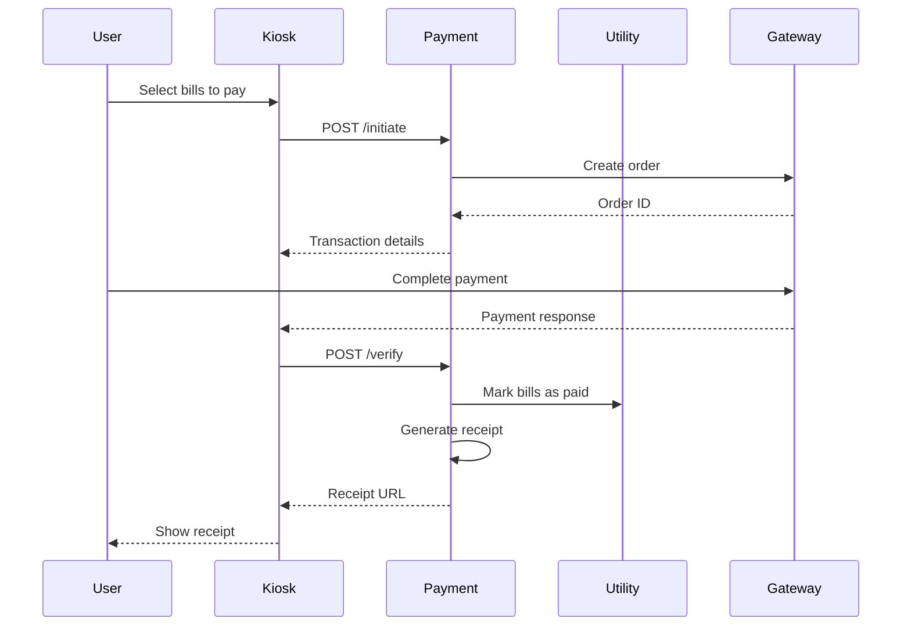

# Payment Service API Documentation

## Overview

The Payment Service handles payment processing, verification, receipt generation, and transaction history for utility bills.

**Base URL:** `http://localhost:8000/api/payment`  
**Port:** 8003  
**Authentication:** Required (JWT Bearer token)

---

## Endpoints

### 1. Initiate Payment

Start a new payment transaction.

**Endpoint:** `POST /initiate`

**Request Body:**
```json
{
  "consumer_id": "TEST001",
  "amount": 1250.75,
  "bill_ids": ["bill-uuid-1", "bill-uuid-2"],
  "payment_method": "MOCK",
  "kiosk_id": "KIOSK_DELHI_01"
}
```

**Example Request:**
```powershell
$body = @{
    consumer_id = "TEST001"
    amount = 1250.75
    bill_ids = @("bill-uuid-1")
    payment_method = "MOCK"
    kiosk_id = "KIOSK_DELHI_01"
} | ConvertTo-Json

$headers = @{ Authorization = "Bearer $token" }

Invoke-RestMethod `
    -Uri "http://localhost:8000/api/payment/initiate" `
    -Method POST `
    -Headers $headers `
    -Body $body `
    -ContentType "application/json"
```

**Response:**
```json
{
  "success": true,
  "data": {
    "transaction_id": "uuid",
    "order_id": "MOCK_1707489600000",
    "amount": 1250.75,
    "currency": "INR",
    "gateway": "mock"
  },
  "timestamp": "2026-02-09T15:00:00Z"
}
```

---

### 2. Verify Payment

Verify and complete a payment transaction.

**Endpoint:** `POST /verify`

**Request Body:**
```json
{
  "transaction_id": "uuid",
  "payment_id": "MOCK_PAY_1707489600000",
  "signature": "optional-signature"
}
```

**Example Request:**
```powershell
$body = @{
    transaction_id = $transaction_id
    payment_id = "MOCK_PAY_1707489600000"
} | ConvertTo-Json

Invoke-RestMethod `
    -Uri "http://localhost:8000/api/payment/verify" `
    -Method POST `
    -Headers $headers `
    -Body $body `
    -ContentType "application/json"
```

**Response:**
```json
{
  "success": true,
  "data": {
    "success": true,
    "transaction_id": "uuid",
    "receipt_url": "/receipts/uuid.pdf"
  },
  "timestamp": "2026-02-09T15:00:00Z"
}
```

**Side Effects:**
- Updates transaction status to SUCCESS
- Marks bills as PAID in Utility Service
- Generates PDF receipt

---

### 3. Get Transaction History

Retrieve all transactions for a consumer.

**Endpoint:** `GET /transactions/:consumer_id`

**Example Request:**
```powershell
Invoke-RestMethod -Uri "http://localhost:8000/api/payment/transactions/TEST001" -Headers $headers
```

**Response:**
```json
{
  "success": true,
  "data": [
    {
      "transaction_id": "uuid",
      "consumer_id": "TEST001",
      "amount": 1250.75,
      "payment_method": "MOCK",
      "gateway_order_id": "MOCK_1707489600000",
      "gateway_payment_id": "MOCK_PAY_1707489600000",
      "status": "SUCCESS",
      "bill_ids": ["bill-uuid-1"],
      "kiosk_id": "KIOSK_DELHI_01",
      "created_at": "2026-02-09T14:00:00Z",
      "completed_at": "2026-02-09T14:05:00Z",
      "receipt_url": "/receipts/uuid.pdf"
    }
  ],
  "timestamp": "2026-02-09T15:00:00Z"
}
```

---

### 4. Get Single Transaction

Retrieve details of a specific transaction.

**Endpoint:** `GET /transaction/:transaction_id`

**Example Request:**
```powershell
Invoke-RestMethod -Uri "http://localhost:8000/api/payment/transaction/$transaction_id" -Headers $headers
```

---

## Payment Flow



---

## Transaction Statuses

- `PENDING`: Payment initiated but not completed
- `SUCCESS`: Payment successful
- `FAILED`: Payment failed
- `REFUNDED`: Payment refunded

---

## Payment Gateways

### Mock Gateway (MVP)
For testing and development. Auto-approves all payments.

**Configuration:**
```env
PAYMENT_GATEWAY=mock
```

### Razorpay (Production - Not Yet Implemented)
For production deployment.

**Configuration:**
```env
PAYMENT_GATEWAY=razorpay
RAZORPAY_KEY_ID=your_key_id
RAZORPAY_KEY_SECRET=your_key_secret
```

---

## Receipt Generation

Receipts are automatically generated as PDF files after successful payment verification.

**Receipt Contents:**
- Transaction ID
- Consumer ID
- Amount paid
- Payment method
- Date and time
- Status
- SUVIDHA branding

**Storage:** Currently returns file path. In production, should upload to S3 or similar storage.

---

## Database Schema

```sql
CREATE TABLE transactions (
  transaction_id UUID PRIMARY KEY,
  consumer_id VARCHAR(50) NOT NULL,
  amount DECIMAL(10, 2) NOT NULL,
  payment_method VARCHAR(50),
  gateway_order_id VARCHAR(200),
  gateway_payment_id VARCHAR(200),
  gateway_response JSON,
  status VARCHAR(20) DEFAULT 'PENDING',
  bill_ids JSON,
  kiosk_id VARCHAR(50),
  created_at TIMESTAMP DEFAULT CURRENT_TIMESTAMP,
  completed_at TIMESTAMP,
  receipt_url VARCHAR(500)
);
```

---

## Error Codes

| Code | Message | Description |
|------|---------|-------------|
| 400 | Missing required fields | consumer_id, amount, or bill_ids missing |
| 401 | Unauthorized | Missing or invalid JWT token |
| 404 | Transaction not found | Transaction ID does not exist |
| 500 | Payment initiation failed | Gateway or database error |
| 500 | Payment verification failed | Verification error |
